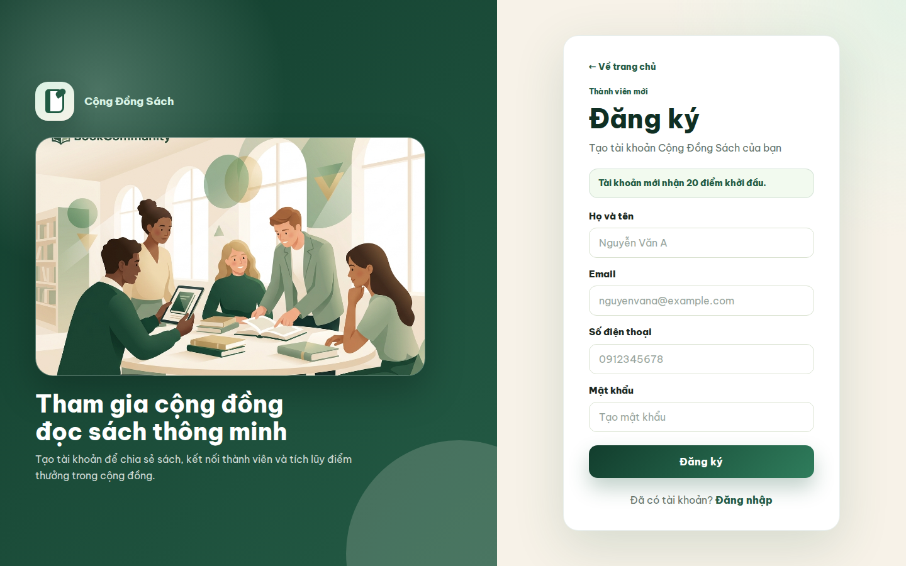
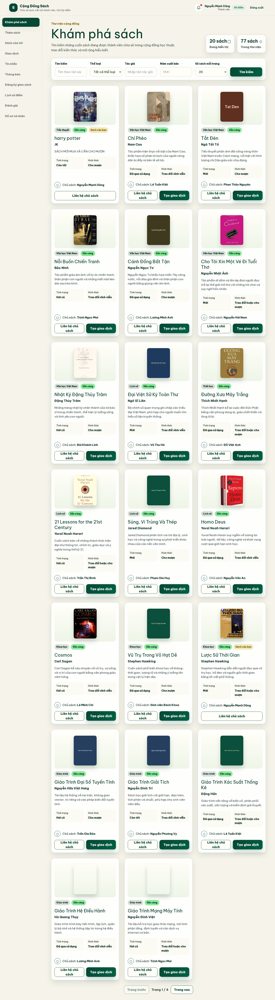
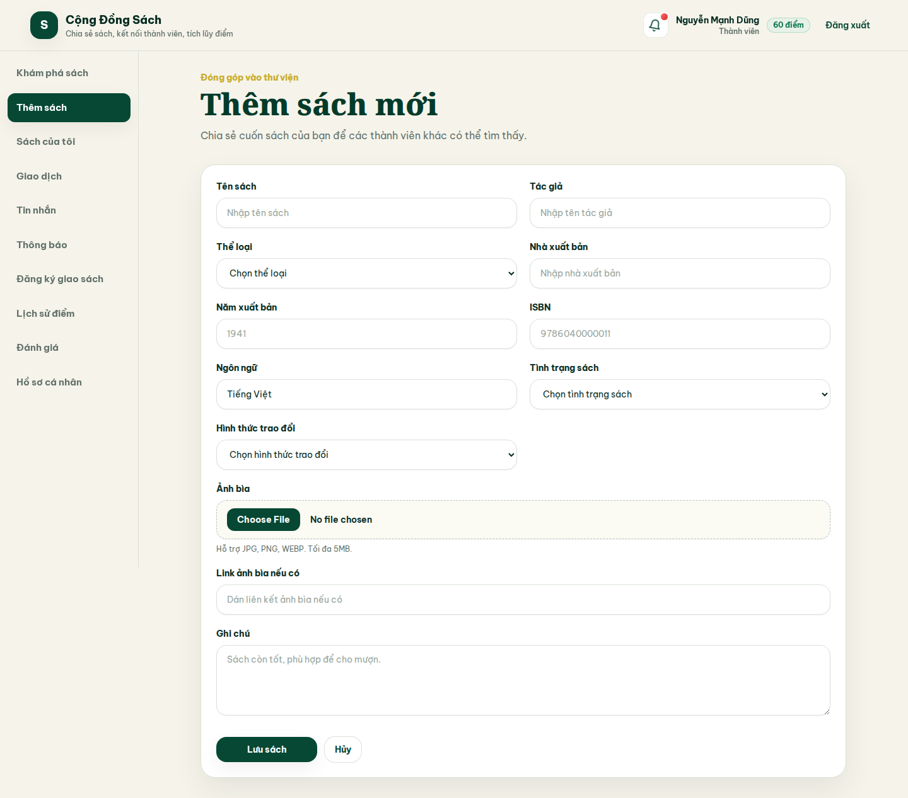
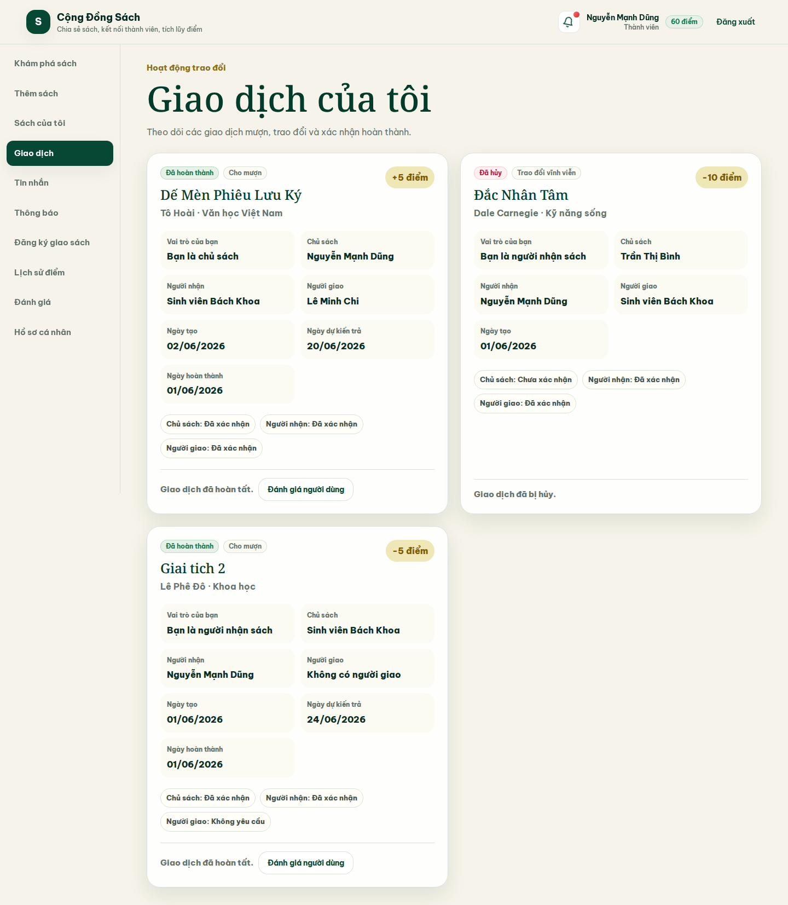
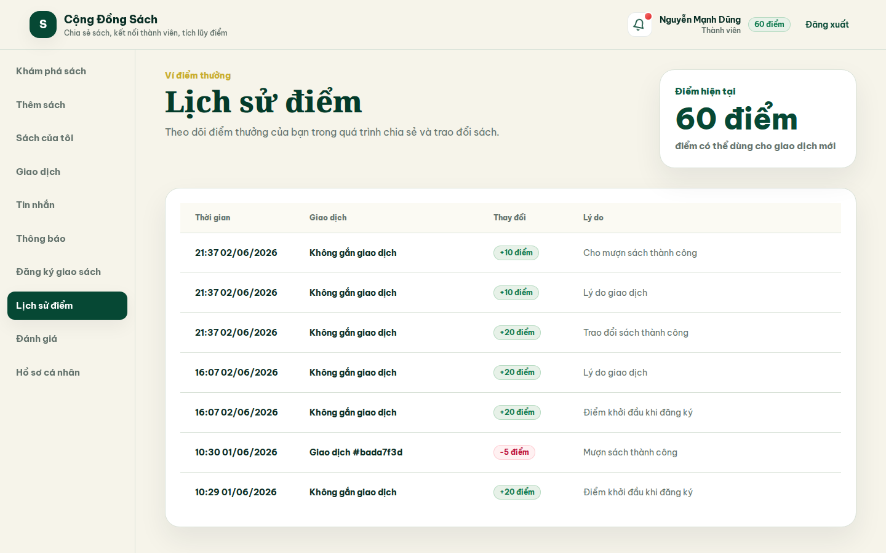
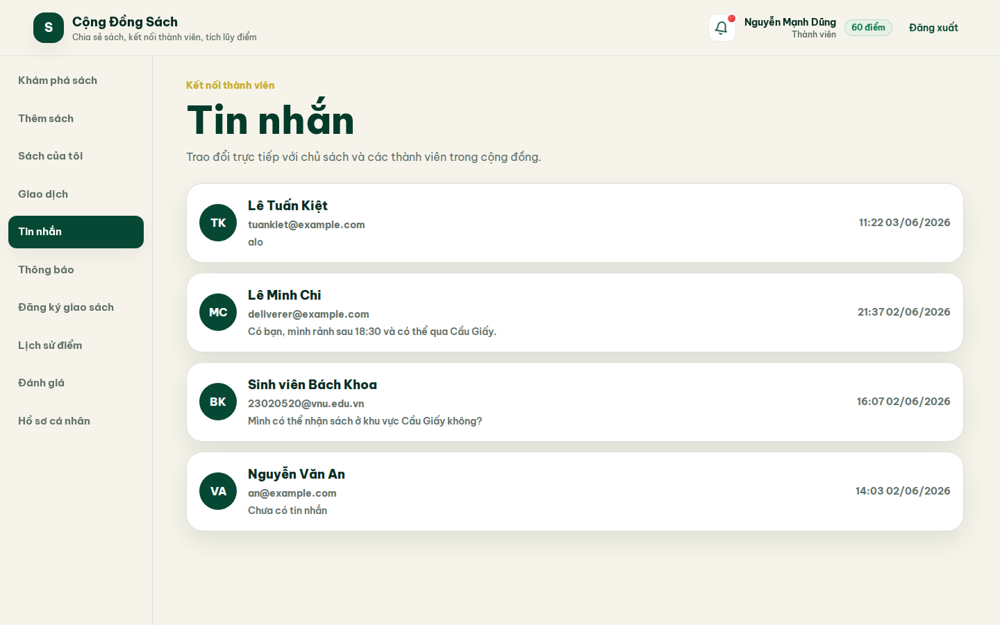
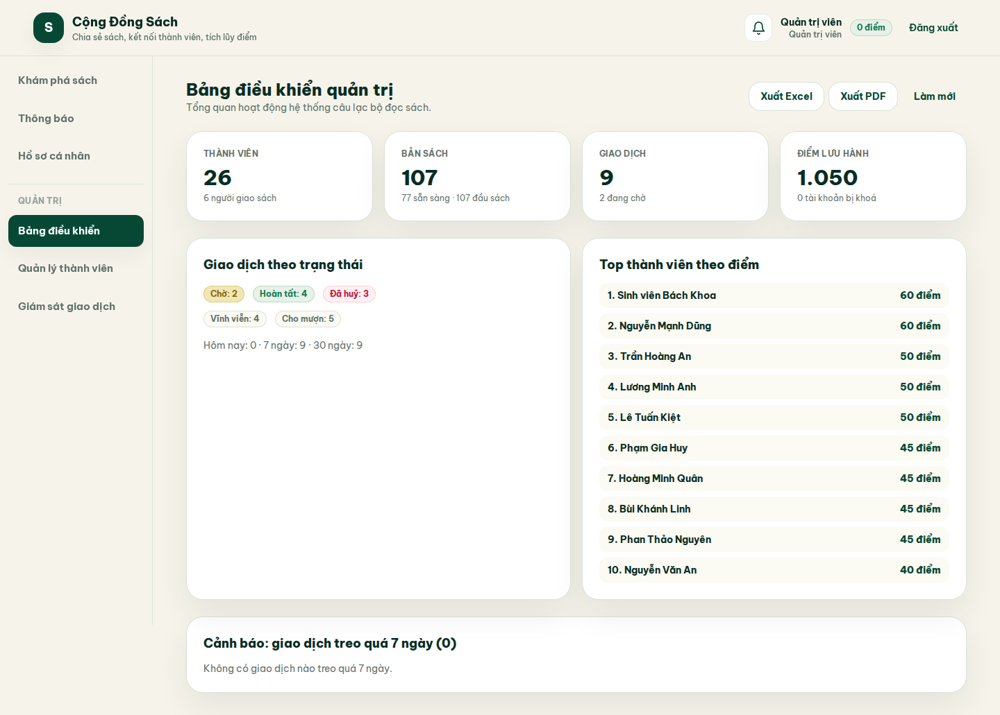

# BookCommunity - Hệ thống kết nối thành viên câu lạc bộ đọc sách

BookCommunity, hay Cộng Đồng Sách, là hệ thống web hỗ trợ thành viên câu lạc bộ đọc sách đăng sách, tìm kiếm sách, liên hệ chủ sách, tạo giao dịch mượn/trao đổi sách, tích điểm, đăng ký người giao sách và đánh giá sau giao dịch.

Hệ thống giải quyết bài toán chia sẻ sách trong cộng đồng:

- Thành viên có sách muốn chia sẻ, trao đổi hoặc cho mượn.
- Thành viên khác muốn tìm sách phù hợp và liên hệ chủ sách.
- Giao dịch được quản lý bằng trạng thái xác nhận rõ ràng.
- Điểm thưởng giúp khuyến khích đóng góp sách và hỗ trợ giao sách.
- Admin có thể giám sát hệ thống, quản lý thành viên và xử lý giao dịch đang treo.

## 1. Giới thiệu hệ thống

BookCommunity gồm frontend React, backend Express và database PostgreSQL. Frontend gọi API backend qua HTTP, backend xác thực người dùng bằng JWT, xử lý nghiệp vụ sách/giao dịch/điểm/tin nhắn và lưu dữ liệu bằng Sequelize.

Cơ chế điểm hiện tại:

| Hoạt động | Điểm |
|---|---:|
| Thành viên mới đăng ký | +20 |
| Trao đổi vĩnh viễn | Chủ sách +10, người nhận -10 |
| Cho mượn sách | Chủ sách +5, người mượn -5 |
| Người giao sách hoàn tất giao sách | +2 |

### Một số giao diện chính

#### Trang chủ


#### Đăng nhập


#### Đăng ký



#### Khám phá sách



#### Thêm sách



#### Giao dịch của tôi



#### Lịch sử điểm



#### Tin nhắn



#### Admin dashboard



## 2. Chức năng chính

### Khách

- Xem trang chủ.
- Đăng ký tài khoản.
- Đăng nhập.

### Thành viên

- Xem và cập nhật hồ sơ cá nhân.
- Đổi mật khẩu.
- Xem danh sách sách.
- Tìm kiếm, lọc và phân trang sách theo từ khóa, thể loại, tác giả, năm xuất bản.
- Thêm sách và upload ảnh bìa.
- Xem, sửa, ẩn/xóa sách của tôi.
- Liên hệ chủ sách và nhắn tin trong cuộc trò chuyện.
- Tạo giao dịch mượn hoặc trao đổi sách.
- Chọn người giao sách nếu cần.
- Xác nhận hoặc hủy giao dịch đang chờ.
- Xem lịch sử điểm.
- Xem thông báo cá nhân.
- Đăng ký làm người giao sách.
- Đánh giá thành viên sau giao dịch hoàn tất.

### Người giao sách

- Đăng ký hồ sơ người giao.
- Cập nhật khu vực và thời gian giao sách.
- Bật/tắt trạng thái hoạt động.
- Xem giao dịch có mình là người giao.
- Xác nhận giao sách.
- Nhận điểm thưởng khi giao dịch có giao sách hoàn tất.

### Admin

Các chức năng admin đã có trong code hiện tại:

- Dashboard thống kê tổng quan hệ thống.
- Quản lý thành viên.
- Tìm kiếm, lọc thành viên theo trạng thái.
- Khóa/mở khóa tài khoản thành viên.
- Xóa thành viên nếu không vướng dữ liệu liên quan.
- Giám sát danh sách giao dịch toàn hệ thống.
- Lọc giao dịch theo trạng thái.
- Hủy giao dịch đang chờ xử lý.
- Cưỡng chế hoàn tất giao dịch đang chờ xử lý.
- Xuất báo cáo tổng hợp dạng Excel hoặc PDF.

Chưa có trang admin quản lý sách riêng và chưa có realtime chat/notification bằng WebSocket.

## 3. Công nghệ sử dụng

| Thành phần | Công nghệ |
|---|---|
| Frontend | React, Vite, CSS |
| Routing | React Router |
| HTTP client | Axios |
| Backend | Node.js, Express |
| Database | PostgreSQL |
| ORM | Sequelize |
| Authentication | JWT, bcrypt |
| Upload file | multer |
| Report export | exceljs, pdfkit |
| DevOps | Docker, Docker Compose |

## 4. Kiến trúc tổng quan

```text
React Frontend  <---- REST API ---->  Express Backend  <---- Sequelize ----> PostgreSQL
                                           |
                                           +---- backend/uploads/book-covers
```

- Frontend React chạy bằng Vite tại `http://localhost:5173`.
- Backend Express chạy tại `http://localhost:5000`.
- API backend có prefix `/api`.
- Các API cần đăng nhập sử dụng header `Authorization: Bearer <token>`.
- Ảnh bìa sách upload được lưu trong `backend/uploads/book-covers`.
- Static upload được phục vụ qua `/uploads`, ví dụ `http://localhost:5000/uploads/book-covers/<filename>`.

## 5. Cấu trúc thư mục

```text
book-club-app/
├── backend/
│   ├── uploads/
│   │   └── book-covers/
│   ├── src/
│   │   ├── config/
│   │   ├── middlewares/
│   │   ├── migrations/
│   │   ├── models/
│   │   ├── modules/
│   │   │   ├── admin/
│   │   │   ├── auth/
│   │   │   ├── books/
│   │   │   ├── conversations/
│   │   │   ├── deliverers/
│   │   │   ├── members/
│   │   │   ├── notifications/
│   │   │   ├── points/
│   │   │   ├── ratings/
│   │   │   └── transactions/
│   │   ├── routes/
│   │   ├── scripts/
│   │   ├── seeders/
│   │   └── utils/
│   └── package.json
├── frontend/
│   ├── src/
│   │   ├── assets/
│   │   ├── components/
│   │   ├── contexts/
│   │   ├── data/
│   │   ├── layouts/
│   │   ├── pages/
│   │   ├── routes/
│   │   ├── services/
│   │   └── utils/
│   └── package.json
├── docs/
│   └── images/
├── docker-compose.yml
└── README.md
```

## 6. Yêu cầu cài đặt

- Node.js >= 18.
- npm >= 9.
- Git.
- Docker Desktop hoặc Docker Engine nếu chạy PostgreSQL bằng Docker Compose.
- PostgreSQL >= 14 nếu không dùng Docker.

Project hiện cấu hình PostgreSQL 16 trong `docker-compose.yml`.

## 7. Cách chạy project

### 7.1. Clone project

```bash
git clone <repo-url>
cd <project-folder>/book-club-app
```

Nếu repository được clone trực tiếp vào thư mục `book-club-app`:

```bash
cd book-club-app
```

### 7.2. Chạy PostgreSQL bằng Docker

```bash
docker compose up -d
```

Cấu hình database mặc định:

| Biến | Giá trị |
|---|---|
| Database | `book_club_db` |
| User | `book_club_user` |
| Password | `book_club_password` |
| Host | `localhost` |
| Port trên máy host | `5433` |
| Port trong container | `5432` |

Kiểm tra container:

```bash
docker compose ps
```

### 7.3. Cài đặt backend

```bash
cd backend
npm install
cp .env.example .env
```

Trên Windows PowerShell:

```powershell
cd backend
npm install
copy .env.example .env
```

Nội dung `backend/.env.example` hiện có:

```env
NODE_ENV=development
PORT=5000

DB_HOST=localhost
DB_PORT=5433
DB_NAME=book_club_db
DB_USER=book_club_user
DB_PASSWORD=book_club_password
DB_DIALECT=postgres
DB_LOGGING=false

JWT_SECRET=change_this_secret
JWT_EXPIRES_IN=7d
```

Lưu ý: đổi `JWT_SECRET` khi triển khai môi trường thật. Không dùng secret demo cho production.

### 7.4. Chạy migration, seed data và tạo admin

Từ thư mục `backend`:

```bash
npm run db:migrate
npm run db:seed
npm run db:create-admin
```

Các alias tương đương:

```bash
npm run migrate
npm run seed
npm run create-admin
```

### 7.5. Chạy backend

Từ thư mục `backend`:

```bash
npm run dev
```

Backend chạy tại:

```text
http://localhost:5000
```

Kiểm tra API:

```bash
curl http://localhost:5000/api/health
```

Kết quả mong đợi:

```json
{
  "success": true,
  "message": "Book Club API is running"
}
```

### 7.6. Cài đặt và chạy frontend

Mở terminal khác từ thư mục `book-club-app`:

```bash
cd frontend
npm install
cp .env.example .env
npm run dev
```

Trên Windows PowerShell:

```powershell
cd frontend
npm install
copy .env.example .env
npm run dev
```

Nội dung `frontend/.env.example` hiện có:

```env
VITE_API_URL=http://localhost:5000
VITE_USE_MOCK_TRANSACTION=false
```

Frontend chạy tại:

```text
http://localhost:5173
```

### 7.7. Build frontend

Từ thư mục `frontend`:

```bash
npm run build
```

## 8. Tài khoản demo

Sau khi chạy seed và `db:create-admin`, có thể dùng các tài khoản sau:

| Vai trò | Email | Password |
|---|---|---|
| Chủ sách chính | `manhdung05072005@gmail.com` | `manhdung123123` |
| Người nhận sách | `23020520@vnu.edu.vn` | `manhdung123123` |
| Người giao sách | `deliverer@example.com` | `manhdung123123` |
| Chủ sách phụ | `owner2@example.com` | `manhdung123123` |
| Người nhận phụ | `receiver2@example.com` | `manhdung123123` |
| Admin | `admin@gmail.com` | `Hungdzvcl2005` |

Nếu admin không đăng nhập được:

```bash
cd backend
npm run db:create-admin
```

## 9. API chính

Base URL:

```text
http://localhost:5000/api
```

Header cho API cần đăng nhập:

```text
Authorization: Bearer <token>
```

### Auth

| Method | Endpoint | Mô tả |
|---|---|---|
| GET | `/api/auth/ping` | Kiểm tra module auth |
| POST | `/api/auth/register` | Đăng ký |
| POST | `/api/auth/login` | Đăng nhập |
| GET | `/api/auth/me` | Lấy thông tin user hiện tại |

### Members/Profile

| Method | Endpoint | Mô tả |
|---|---|---|
| GET | `/api/members/me` | Xem hồ sơ |
| PUT | `/api/members/me` | Cập nhật hồ sơ |
| PUT | `/api/members/me/password` | Đổi mật khẩu |
| GET | `/api/members/me/points` | Lấy điểm/lịch sử điểm theo member |

### Books

| Method | Endpoint | Mô tả |
|---|---|---|
| GET | `/api/books` | Danh sách sách available, có filter/pagination |
| GET | `/api/books/my` | Sách của tôi |
| GET | `/api/books/:copyId` | Chi tiết một bản sách |
| POST | `/api/books` | Thêm sách |
| PUT | `/api/books/:copyId` | Sửa sách của tôi |
| DELETE | `/api/books/:copyId` | Ẩn/xóa sách của tôi |

Query hỗ trợ cho `GET /api/books`:

```text
page
limit
keyword
category
author
year
publication_year
```

Upload ảnh bìa khi thêm sách:

- Dùng `multipart/form-data`.
- Field file: `cover`.
- Chỉ nhận JPG, PNG, WEBP theo middleware upload.
- URL lưu trong database dạng `/uploads/book-covers/<filename>`.

### Conversations

| Method | Endpoint | Mô tả |
|---|---|---|
| GET | `/api/conversations` | Danh sách cuộc trò chuyện của tôi |
| POST | `/api/conversations/:userId` | Tạo hoặc lấy cuộc trò chuyện với user |
| GET | `/api/conversations/:conversationId/messages` | Tin nhắn trong cuộc trò chuyện |
| POST | `/api/conversations/:conversationId/messages` | Gửi tin nhắn |

### Transactions

| Method | Endpoint | Mô tả |
|---|---|---|
| GET | `/api/transactions/ping` | Kiểm tra module transaction |
| POST | `/api/transactions` | Tạo giao dịch |
| GET | `/api/transactions/my` | Giao dịch liên quan tới tôi |
| GET | `/api/transactions/:transactionId` | Chi tiết giao dịch |
| PUT | `/api/transactions/:transactionId/confirm` | Xác nhận giao dịch hoặc xác nhận giao sách |
| PUT | `/api/transactions/:transactionId/cancel` | Hủy giao dịch pending |

Payload tạo giao dịch không có người giao:

```json
{
  "copy_id": "book-copy-uuid",
  "transaction_type": "permanent"
}
```

Payload tạo giao dịch có người giao:

```json
{
  "copy_id": "book-copy-uuid",
  "transaction_type": "lending",
  "expected_return_date": "2026-06-30",
  "deliverer_id": "deliverer-member-uuid"
}
```

### Points

| Method | Endpoint | Mô tả |
|---|---|---|
| GET | `/api/points/ping` | Kiểm tra module points |
| GET | `/api/points/history` | Lịch sử điểm của user hiện tại |

### Deliverers

| Method | Endpoint | Mô tả |
|---|---|---|
| GET | `/api/deliverers/ping` | Kiểm tra module deliverers |
| GET | `/api/deliverers` | Danh sách người giao sách đang hoạt động |
| POST | `/api/deliverers/register` | Đăng ký làm người giao sách |
| GET | `/api/deliverers/me` | Hồ sơ giao sách của tôi |
| PUT | `/api/deliverers/me` | Cập nhật hồ sơ giao sách |

### Notifications

| Method | Endpoint | Mô tả |
|---|---|---|
| GET | `/api/notifications` | Danh sách thông báo của tôi |
| GET | `/api/notifications/summary` | Tóm tắt thông báo |
| GET | `/api/notifications/unread-count` | Số thông báo chưa đọc |
| PUT | `/api/notifications/read-all` | Đánh dấu tất cả đã đọc |
| PUT | `/api/notifications/:notificationId/read` | Đánh dấu một thông báo đã đọc |

### Ratings

| Method | Endpoint | Mô tả |
|---|---|---|
| POST | `/api/ratings` | Tạo đánh giá sau giao dịch completed |
| GET | `/api/ratings/member/:memberId` | Xem đánh giá của một thành viên |
| GET | `/api/ratings/my-received` | Đánh giá tôi nhận được |
| GET | `/api/ratings/my-given` | Đánh giá tôi đã gửi |

### Admin

Admin API yêu cầu JWT hợp lệ và role `admin`.

| Method | Endpoint | Mô tả |
|---|---|---|
| GET | `/api/admin/stats` | Thống kê dashboard admin |
| GET | `/api/admin/members` | Danh sách thành viên |
| PUT | `/api/admin/members/:memberId/status` | Khóa hoặc mở khóa thành viên |
| DELETE | `/api/admin/members/:memberId` | Xóa thành viên nếu không vướng dữ liệu liên quan |
| GET | `/api/admin/transactions` | Danh sách giao dịch toàn hệ thống |
| PUT | `/api/admin/transactions/:transactionId/cancel` | Admin hủy giao dịch pending |
| PUT | `/api/admin/transactions/:transactionId/force-complete` | Admin cưỡng chế hoàn tất giao dịch pending |
| GET | `/api/reports/summary?format=xlsx` | Xuất báo cáo Excel |
| GET | `/api/reports/summary?format=pdf` | Xuất báo cáo PDF |

## 10. Frontend routes

### Public

| Route | Mô tả |
|---|---|
| `/` | Trang chủ |
| `/login` | Đăng nhập |
| `/register` | Đăng ký |

### User

| Route | Mô tả |
|---|---|
| `/books` | Khám phá sách |
| `/books/new` | Thêm sách |
| `/books/add` | Alias thêm sách |
| `/my-books` | Sách của tôi |
| `/transactions` | Giao dịch của tôi |
| `/conversations` | Danh sách cuộc trò chuyện |
| `/conversations/:conversationId` | Chi tiết cuộc trò chuyện |
| `/notifications` | Thông báo |
| `/deliverer-profile` | Hồ sơ người giao sách |
| `/profile` | Hồ sơ cá nhân |
| `/ratings` | Đánh giá |
| `/points/history` | Lịch sử điểm |

### Admin

| Route | Mô tả |
|---|---|
| `/admin` | Dashboard admin |
| `/admin/members` | Quản lý thành viên |
| `/admin/transactions` | Giám sát và xử lý giao dịch |

## 11. Luồng demo gợi ý

### Luồng 1: Thành viên tạo giao dịch không có người giao

1. Đăng nhập bằng tài khoản người nhận, ví dụ `23020520@vnu.edu.vn`.
2. Vào `/books`.
3. Chọn sách của thành viên khác.
4. Tạo giao dịch vĩnh viễn hoặc cho mượn.
5. Người nhận xác nhận.
6. Đăng xuất, đăng nhập bằng chủ sách.
7. Chủ sách xác nhận.
8. Giao dịch chuyển `completed`.
9. Kiểm tra `/points/history`.

### Luồng 2: Giao dịch có người giao sách

1. Đăng nhập bằng người nhận.
2. Vào `/books`.
3. Tạo giao dịch và chọn người giao sách.
4. Người nhận và chủ sách xác nhận.
5. Giao dịch vẫn `pending` nếu người giao chưa xác nhận.
6. Đăng nhập bằng người giao sách, ví dụ `deliverer@example.com`.
7. Vào `/transactions`.
8. Xác nhận giao sách.
9. Giao dịch chuyển `completed`.
10. Người giao sách nhận +2 điểm.

### Luồng 3: Admin xử lý giao dịch

1. Đăng nhập bằng `admin@gmail.com`.
2. Vào `/admin` để xem thống kê.
3. Vào `/admin/members` để khóa/mở khóa thành viên.
4. Vào `/admin/transactions` để xem giao dịch.
5. Với giao dịch `pending`, admin có thể hủy hoặc cưỡng chế hoàn tất.
6. Xuất báo cáo từ dashboard admin nếu cần.

## 12. Script npm

### Backend

| Script | Mô tả |
|---|---|
| `npm run dev` | Chạy backend bằng nodemon |
| `npm run start` | Chạy backend bằng node |
| `npm run db:migrate` | Chạy migration |
| `npm run db:seed` | Chạy seed data |
| `npm run db:create-admin` | Tạo hoặc cập nhật admin |
| `npm run migrate` | Alias của `db:migrate` |
| `npm run seed` | Alias của `db:seed` |
| `npm run create-admin` | Alias của `db:create-admin` |

### Frontend

| Script | Mô tả |
|---|---|
| `npm run dev` | Chạy Vite dev server |
| `npm run build` | Build production |
| `npm run preview` | Preview bản build |

## 13. Troubleshooting

### Backend không kết nối được PostgreSQL

Kiểm tra Docker:

```bash
docker compose ps
```

Nếu compose publish port `5433:5432`, `backend/.env` phải dùng:

```env
DB_PORT=5433
```

Sau khi sửa `.env`, restart backend.

### Lỗi `Route not found: POST /auth/register`

Backend API có prefix `/api`. Endpoint đúng là:

```text
POST http://localhost:5000/api/auth/register
```

Frontend nên dùng:

```env
VITE_API_URL=http://localhost:5000
```

### Giao dịch hiển thị dữ liệu giả

Kiểm tra frontend env:

```env
VITE_USE_MOCK_TRANSACTION=false
```

### Admin không đăng nhập được

Chạy lại:

```bash
cd backend
npm run db:create-admin
```

Sau đó đăng nhập:

```text
admin@gmail.com / Hungdzvcl2005
```

### Ảnh upload không hiển thị

Backend phục vụ static upload qua:

```text
http://localhost:5000/uploads/book-covers/<filename>
```

Kiểm tra file có tồn tại trong:

```text
backend/uploads/book-covers
```

### Chạy `npm` trong WSL bị nhảy sang CMD/UNC path

Nếu terminal WSL báo `UNC paths are not supported`, hãy đảm bảo dùng Node/npm trong WSL thay vì Node Windows. Một cách đơn giản là cài Node bằng `nvm` trong WSL hoặc mở terminal trực tiếp tại đường dẫn Linux như `/home/<user>/...`.

## 14. Kiểm tra nhanh trước demo

Từ `book-club-app/backend`:

```bash
npm run db:migrate
npm run db:seed
npm run db:create-admin
npm run dev
```

Từ `book-club-app/frontend`:

```bash
npm run build
npm run dev
```

Mở:

```text
http://localhost:5173/
http://localhost:5173/books
http://localhost:5173/admin
```

Kiểm tra API:

```bash
curl http://localhost:5000/api/health
```

## 15. Hướng phát triển

- Chat realtime bằng WebSocket.
- Notification realtime.
- Trang admin quản lý sách riêng.
- Admin xử lý báo cáo vi phạm.
- Export báo cáo nâng cao theo khoảng thời gian.
- Upload ảnh lên cloud storage như S3 hoặc Cloudinary.
- Email verification thật.
- Test tự động end-to-end cho các luồng giao dịch chính.

## 16. Ghi chú bảo mật

- Không commit file `.env` thật.
- Không dùng `JWT_SECRET` mặc định cho production.
- Mật khẩu được hash bằng bcrypt.
- API admin được bảo vệ bằng JWT và role `admin`.
- API upload chỉ nhận ảnh JPG, PNG hoặc WEBP.
